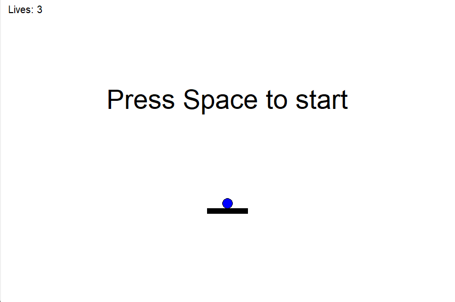
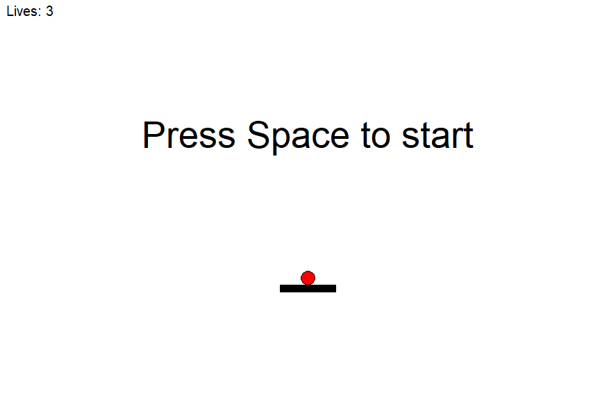

<div align="center">

# Dev/Release repo maintenance - Paddle and ball game as an example


</div>

-----------------------------------------------
Clone the release repo (public) and the dev repo (private).
```
git clone https://github.com/charlenemauger1/test-release
git clone https://github.com/charlenemauger1/test-dev
```


You can check what the game currently looks like in the release branch:
```
cd test-release
python main.py
```


## Development pipeline
Create a remote connection from **test-release** into **test-dev** (you only need to do this once on your local machine)
```
cd test-dev
git remote add test-release https://github.com/charlenemauger1/test-release
```

Verify the connection
```
git remote -v
```

You should be getting something like this:
```
origin  https://github.com/charlenemauger1/test-dev (fetch)
origin  https://github.com/charlenemauger1/test-dev (push)
test-release    https://github.com/charlenemauger1/test-release (fetch)
test-release    https://github.com/charlenemauger1/test-release (push)
```

Now, let's say, we want to change the color of the ball. This will be our future release: same game, just a different ball color. To do so, I make my changes into the development branch (or any other branch other than main) of the **test-dev** repo and, once I am happy with it, I merge it into the main branch (simplified here - will go through the PR process for biv-me). 
To change the color of the ball, first checkout the development branch:

```
git checkout development
```

change line 100 in main.py from

```item = canvas.create_oval(x-self.radius, y-self.radius, x+self.radius, y+self.radius, fill='blue')```

to 

```item = canvas.create_oval(x-self.radius, y-self.radius, x+self.radius, y+self.radius, fill='red')```

push your changes to the development branch
```
git add main.py
git commit -m "change color from blue to red"
git push
```

With biv-me, we will do the usual PR process before merging into main, here I am just going to use a brute force merge for this example
```
git checkout main
git merge development
```

The main branch of **dev-repo** is now up to date with the development branch and we want to push this *new release* to our **release-repo**. To do so, just type (make sure to be on the main branch, not the development branch)
```
git push test-release
```

This will push the changes from the main branch of **dev-repo** to the remote main branch of **release-repo**. 

To check that the changes went through: 
```
cd test-release 
git pull    # get latest changes
python main.py
```

The ball is now red on your release branch :smile:
..


